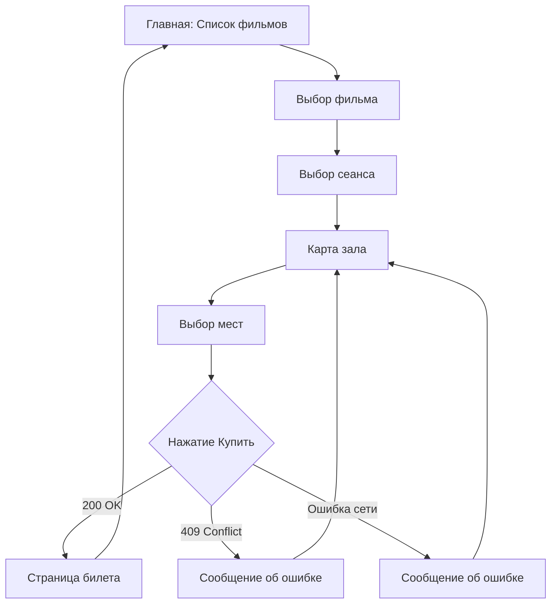

## Вступление

Данная лабораторная работа — финальная. Мы завершаем полный цикл приложения: от выбора фильма до получения билета.

**Что будем делать:**

- Реализация POST-запроса для бронирования
- Обработка различных ответов сервера
- Отображение билета (QR-код)
- Финализация навигации между экранами

После этой лабы у тебя будет полноценное приложение киоска бронирования билетов!

---

## Техническое задание

[Требования к программе, необходимые для сдачи.](../tasks/task6.md)

---

## Git-воркфлоу

```bash
git checkout -b feature/lab-6-booking
```

---

## Шаг 1: Модель запроса бронирования

Создай модель `BookingRequest.cs`:

```csharp
public class BookingRequest
{
    public int SessionId { get; set; }
    public List<SeatInfo> Seats { get; set; }
}

public class SeatInfo
{
    public int Row { get; set; }
    public int Number { get; set; }
}
```

И модель ответа `BookingResponse.cs`:

```csharp
public class BookingResponse
{
    public bool Success { get; set; }
    public string BookingId { get; set; }
    public string QrCodeUrl { get; set; }
    public string ErrorMessage { get; set; }
}
```

---

## Шаг 2: POST-запрос в ApiService

Добавляем метод для бронирования:

```csharp
public async Task<BookingResponse> CreateBookingAsync(BookingRequest request)
{
    var json = JsonConvert.SerializeObject(request);
    var content = new StringContent(json, Encoding.UTF8, "application/json");
    
    var response = await _client.PostAsync($"{BaseUrl}/booking", content);
    var responseJson = await response.Content.ReadAsStringAsync();
    
    if (response.IsSuccessStatusCode)
    {
        return JsonConvert.DeserializeObject<BookingResponse>(responseJson);
    }
    
    // Обработка ошибок
    return new BookingResponse
    {
        Success = false,
        ErrorMessage = GetErrorMessage(response.StatusCode, responseJson)
    };
}

private string GetErrorMessage(HttpStatusCode statusCode, string responseJson)
{
    return statusCode switch
    {
        HttpStatusCode.Conflict => "Место уже занято кем-то другим. Выберите другое место.",
        HttpStatusCode.BadRequest => "Ошибка в запросе. Проверьте выбранные места.",
        _ => $"Произошла ошибка: {statusCode}"
    };
}
```

---

## Шаг 3: Обработка нажатия "Купить"

В `HallPage.xaml.cs`:

```csharp
private async void BuyButton_Click(object sender, RoutedEventArgs e)
{
    if (_selectedSeats.Count == 0)
    {
        MessageBox.Show("Выберите хотя бы одно место!", "Внимание", 
                        MessageBoxButton.OK, MessageBoxImage.Warning);
        return;
    }
    
    // Формируем запрос
    var request = new BookingRequest
    {
        SessionId = _sessionId,
        Seats = _selectedSeats.Select(s => new SeatInfo
        {
            Row = s.Row,
            Number = s.Number
        }).ToList()
    };
    
    // Показываем индикатор загрузки
    BuyButton.IsEnabled = false;
    BuyButton.Content = "Обработка...";
    
    try
    {
        var result = await _apiService.CreateBookingAsync(request);
        
        if (result.Success)
        {
            // Переход на страницу билета
            NavigationService.Navigate(new TicketPage(result));
        }
        else
        {
            MessageBox.Show(result.ErrorMessage, "Ошибка", 
                            MessageBoxButton.OK, MessageBoxImage.Error);
            
            // Обновляем карту зала (места могли измениться)
            await RefreshHall();
        }
    }
    catch (Exception ex)
    {
        MessageBox.Show($"Ошибка сети: {ex.Message}", "Ошибка", 
                        MessageBoxButton.OK, MessageBoxImage.Error);
    }
    finally
    {
        BuyButton.IsEnabled = true;
        BuyButton.Content = "Купить билеты";
    }
}
```

---

## Шаг 4: Страница билета

Создай `TicketPage.xaml`:

```xml
<Page x:Class="CinemaKiosk.Pages.TicketPage"
      xmlns="http://schemas.microsoft.com/winfx/2006/xaml/presentation"
      xmlns:x="http://schemas.microsoft.com/winfx/2006/xaml"
      Title="Ваш билет">
    <Grid>
        <Border Background="{DynamicResource CardBrush}" 
                CornerRadius="20" 
                Margin="50" 
                Padding="30">
            <StackPanel HorizontalAlignment="Center">
                
                <TextBlock Text="Бронирование успешно!" 
                           FontSize="28" 
                           FontWeight="Bold" 
                           HorizontalAlignment="Center"/>
                
                <TextBlock x:Name="BookingIdText" 
                           FontSize="16" 
                           Foreground="Gray" 
                           Margin="0,10,0,30"
                           HorizontalAlignment="Center"/>
                
                <!-- QR-код -->
                <Image x:Name="QrCodeImage" 
                       Width="200" Height="200" 
                       Margin="0,0,0,30"/>
                
                <TextBlock Text="Покажите этот QR-код на кассе" 
                           HorizontalAlignment="Center" 
                           Foreground="Gray"/>
                
                <Button Content="На главную" 
                        Style="{StaticResource PrimaryButton}"
                        Margin="0,30,0,0"
                        Click="HomeButton_Click"/>
                
            </StackPanel>
        </Border>
    </Grid>
</Page>
```

`TicketPage.xaml.cs`:

```csharp
public partial class TicketPage : Page
{
    public TicketPage(BookingResponse booking)
    {
        InitializeComponent();
        
        BookingIdText.Text = $"Номер брони: {booking.BookingId}";
        
        if (!string.IsNullOrEmpty(booking.QrCodeUrl))
        {
            QrCodeImage.Source = new BitmapImage(new Uri(booking.QrCodeUrl));
        }
    }
    
    private void HomeButton_Click(object sender, RoutedEventArgs e)
    {
        NavigationService.Navigate(new MainPage());
    }
}
```

---

## Шаг 5: Обработка HTTP-кодов

| Код | Значение | Действие в приложении |
|-----|----------|----------------------|
| 200 OK | Успех | Переход на страницу билета |
| 409 Conflict | Место занято | Сообщение + обновление карты зала |
| 400 Bad Request | Ошибка запроса | Сообщение об ошибке |
| 500 Server Error | Ошибка сервера | "Попробуйте позже" |

```csharp
// Пример обработки конкретного кода
if (response.StatusCode == HttpStatusCode.Conflict)
{
    // Кто-то успел забронировать раньше
    MessageBox.Show("Упс! Это место только что забронировали. " +
                    "Выберите другое место.", "Место занято");
    await RefreshHall(); // Обновляем карту
}
```

---

## Шаг 6: Навигация между страницами

Используй `Frame` для навигации:

```xml
<!-- В MainWindow.xaml -->
<Window ...>
    <Frame x:Name="MainFrame" NavigationUIVisibility="Hidden"/>
</Window>
```

```csharp
// В коде
MainFrame.Navigate(new MoviesPage());
MainFrame.Navigate(new HallPage(sessionId));
MainFrame.Navigate(new TicketPage(booking));
```

---

## Полный User Flow



---

## Коммит и Push

```bash
git add .
git commit -m "feat: add booking flow and ticket page"
git push origin feature/lab-6-booking
```

Создай финальный Pull Request!

---

## Полезные ссылки

- [HttpClient POST](https://docs.microsoft.com/en-us/dotnet/api/system.net.http.httpclient.postasync)
- [Navigation Overview](https://docs.microsoft.com/en-us/dotnet/desktop/wpf/app-development/navigation-overview)
- [Async/Await](../topics/asyncawait.md)

