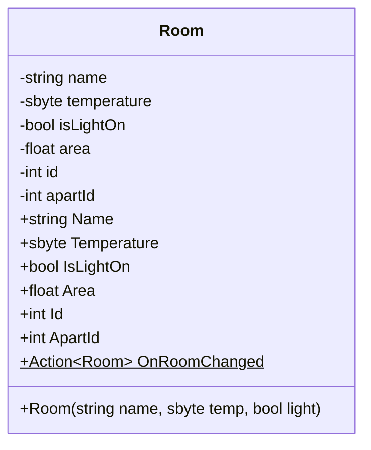

## Вступление

>>>**Для выполнения данной лабораторной работы предполагается создать новый проект и скопировать туда необходимые файлы (например класс комнаты).**

Данный текст содержит описание хода работы.

Современные приложения, от простых мобильных утилит до сложных корпоративных систем, нуждаются в эффективном способе хранения, управления и извлечения данных.

Для этих целей повсеместно используются базы данных (БД). Вместо того чтобы хранить информацию в разрозненных файлах, что чревато несогласованностью, трудностями поиска и проблемами безопасности, разработчики полагаются на Системы Управления Базами Данных (СУБД).

Многие популярные СУБД (например, PostgreSQL, MySQL, MS SQL Server) работают как отдельные серверные приложения, часто на удаленных машинах. 

Но существуют и другие решения. Одним из таких решений является **SQLite** — компактная, встраиваемая, реляционная СУБД, которая хранит всю базу данных в одном файле непосредственно на устройстве пользователя. 

Это позволяет использовать SQLite для локальных десктопных (как в нашем случае с WPF) или мобильных приложений для небольших pet-проектов или в учебных целях.

**Цель данной лабораторной работы** — получить практические навыки работы с базами данных на примере SQLite в контексте разработки настольного приложения. В ходе работы мы:

- Создадим структуру базы данных с использованием SQLite для наших комнат и квартир.
- Освоим базовые операции языка SQL для манипулирования данными (создание таблиц, вставка, выборка, обновление, удаление записей).
- Разработаем функционал в приложении WPF для взаимодействия с созданной базой данных: отображения, добавления и редактирования информации.

## Установка DB Browser

Скачать приложение для работой с базами данных [можно тут](https://sqlitebrowser.org/dl/).
Отличия версий: 

- [Standard installer for 64-bit Windows](https://github.com/sqlitebrowser/sqlitebrowser/releases/download/v3.13.1/DB.Browser.for.SQLite-v3.13.1-win64.msi) - версия, устанавливающаяся на компьютер.
- [.zip (no installer) for 64-bit Windows](https://github.com/sqlitebrowser/sqlitebrowser/releases/download/v3.13.1/DB.Browser.for.SQLite-v3.13.1-win64.zip) - портативная версия, без установки, все файлы в архиве.


## Создание таблиц

[Про основные запросы в SQL](../topics/sql-samples)

### Мы создадим 3 таблицы:

1. Таблица "**Квартира**" - данная таблица будет содержать: 
	- Id квартиры - первичный ключ;
	- Номер квартиры - просто номер (25, 101, 102А);
	- Описание квартиры - текстовое описание квартиры. 
	Сможет содержать в себе несколько комнат, связь *один ко многим*.
2. Таблица "**Комната**" - данная таблица будет содержать:
	- Id комнаты - первичный ключ;
	- Ключ квартиры - для связи в квартирой. В комнате мы укажем принадлежность к конкретной квартире;
	- Название комнаты - текстовое название;
3. Таблица "**Информация_о_комнате**" - таблиц будет содержать:
	- Id комнаты - первичный и внешний ключ, обеспечит связь с **Комнатой**;
	- Площадь - дробное число, для площади комнаты;
	- Температура - дробное число, температура;
	- Состояние света - целое число, с проверкой на только 0 или 1.
	Будет строго привязан к ОДНОЙ единственной комнате. Связь *один к одному*.

>А зачем нам разделять так таблицы? Неудобно же.


На первый взгляд действительно кажется, что проще свалить всё в одну большую таблицу. Но давайте разберемся, почему так почти никогда не делают в реальных базах данных.

[Душный (очень интересный) ответ почему так](../../topics/db-normalizing-why)

### Страшная схема базы данных:
```kroki-mermaid
erDiagram
    Apartments ||--o{ Rooms : contains
    Rooms      ||--|| RoomInfo : has_details

    Apartments {
        INTEGER Id PK "Primary Key (AUTOINCREMENT)"
        INT ApartmentNumber "NOT NULL, UNIQUE"
        TEXT Description
    }

    Rooms {
        INTEGER Id PK "Primary Key (AUTOINCREMENT)"
        INTEGER ApartmentId FK "NOT NULL, Foreign Key to Apartments.Id"
        TEXT Name "NOT NULL"
    }

    RoomInfo {
        INTEGER RoomId PK, FK "Primary Key, Foreign Key to Rooms.Id"
        REAL Area "NOT NULL"
        REAL Temperature "NOT NULL"
        INTEGER IsLightOn "NOT NULL, CHECK(0 or 1)"
    }

%% -- Cardinality Explanation --
%% Apartments ||--o{ Rooms : One Apartment can contain zero or more Rooms.
%%                           A Room must belong to exactly one Apartment (due to NOT NULL FK).
%% Rooms ||--|| RoomInfo   : One Room has exactly one RoomInfo record (PK=FK implies 1-to-1).
%%                           A RoomInfo record belongs to exactly one Room.
%% -- Foreign Key Constraints --
%% Rooms.ApartmentId --> Apartments.Id (ON DELETE CASCADE)
%% RoomInfo.RoomId --> Rooms.Id (ON DELETE CASCADE)
```

Создавать таблицы предлагается через вкладку [Execute SQL](../../topics/db-browser-info#execute-sql).

### Пример запроса на создание таблицы Квартира:

```sql
-- Таблица Квартиры
CREATE TABLE Apartment (
    Id INTEGER PRIMARY KEY AUTOINCREMENT, --Первичный ключ квартиры, автоинкремент (сам делает +1 к счетчику)
    ApartmentNumber INT NOT NULL UNIQUE, --Номер квартиры, можно поменять на TEXT, тогда можно будет делать "101А", не пустое, уникальное (без повторов)
    Description TEXT --Просто описание квартиры
);
```

### Пример запроса на создание таблицы Комната:

```sql
-- Таблица Комнаты
CREATE TABLE Rooms (
    Id INTEGER PRIMARY KEY AUTOINCREMENT, --Первичный ключ комнаты, автоинкремент (сам делает +1 к счетчику)
    ApartmentId INTEGER NOT NULL, -- Комната принадлежит определенной квартире, не пустое
    Name TEXT NOT NULL,           -- Название комнаты
    FOREIGN KEY(ApartmentId) REFERENCES Apartment(Id) ON DELETE CASCADE 
    -- Связываем поле ApartmentId с Id из таблицы Apartment.
    -- ON DELETE CASCADE - ограничение, если удалить квартиру - удалятся комнаты, у которых ApartmentId равен Id из таблицы Apartment.
);
```

### Пример запроса на создание таблицы Информация_о_комнате:

```sql
-- Таблица Информация о комнате (Связь 1-к-1 с Rooms)
CREATE TABLE RoomInfo (
    RoomId INTEGER PRIMARY KEY, -- Первичный ключ (Primary Key) является одновременно и внешним ключом (Foreign Key), обеспечивает строгую связь 1-к-1
	Area REAL NOT NULL, --Площадь комнаты, не пустое
    Temperature INTEGER NOT NULL, --Температура в комнате, не пустое
    IsLightOn INTEGER NOT NULL CHECK (IsLightOn IN (0, 1)), 
    -- Состояние света, не пустое
    -- CHECK гарантирует только 0 или 1
    FOREIGN KEY(RoomId) REFERENCES Rooms(Id) ON DELETE CASCADE 
    -- Связываем RoomId с Id из таблицы Rooms
    -- Если удалить комнату, удалить и ее информацию
);
```

**Важно:** создавать таблицы нужно в определенном порядке, так как при создании таблицы `Комната` мы ссылаемся на первичный ключ из таблицы `Квартиры`. Если попытаться создать сначала `Комната` - мы получим ошибку. Аналогично происходит создание таблицы `Информация_о_комнате`.

### Пример структуры БД после создания таблиц 


**Важно:** обратите внимание на кнопку **"Записать изменения"** - после создания таблиц она станет активной. Изменения в базе данных нужно сохранять, важно следить за этим.
## Заполнение таблицы

### Порядок заполнения таблиц.

Заполнять таблицы также нужно в определенном порядке:

1. Создать квартиру;
2. Создать комнату;
3. Создать информацию_о_комнате.

### Пример создания Квартиры

```sql
INSERT INTO Apartment (ApartmentNumber, Description) VALUES (1,'Описание для квартиры 1')
-- Apartment - название таблицы;
--ApartmentNumber - номер квартиры, в примере используется INT;
--Description - Описание для квартиры.
```

### Пример созданной Квартиры

Во вкладке `Browse Data` теперь мы можем выбрать таблицу `Apartment` и увидеть новую запись:


### Пример создания Комнаты

```sql
INSERT INTO Rooms (ApartmentId, Name) VALUES (1,'Комната 1')
-- Rooms - название таблицы;
-- ApartmentId (НЕ ПУТАТЬ С ApartmentNumber) - Первичный ключ из таблицы Квартир, обязательно указывать существующий
-- Name - название комнаты
```

### Пример созданной Комнаты


Теперь у нас есть комната, которая *принадлежит* квартире 1.

### Пример создания Информации_о_комнате

```sql
INSERT INTO RoomInfo (RoomId, Area, Temperature, IsLightOn) VALUES (1, 6, 20, 0)
-- RoomInfo - название таблицы;
-- RoomId - первичный ключ комнаты из таблицы Комнат, должен быть существующий - иначе ошибка;
-- Area - площадь комнаты, дробное число;
-- Temperature - температура, дробное число;
-- IsLightOn - состояние света, допустимы только 1 или 0 - иначе ошибка
```

### Пример созданной Информации_о_комнате


Теперь у нас есть `RoomInfo` в которой содержится ключ принадлежности к комнате - `RoomId`.

### Пример заполненной таблицы


### Только 3% студентов читают этот пост... (Сброс счетчика автоинкремента)

При **проектировании** базы данных (в нашем случае это попытки сделать все таблицы и связи и не поломать связь между таблицами) мы часто будем удалять записи в базе данных (не путайте с DROP TABLE). 

Ограничение [АвтоИнкремент](../../topics/db-browser-info/#_3) автоматически делает +1 к первичному ключу в таблице. Может случится ситуация, что вы добавили запись в таблицу `Комната`, в `Информация_о_комнате` - нет. И тогда первичные ключи могут отличаться в этих таблицах.

И даже если вы удалите все записи в таблицах, допустим, их было у вас 10, и начнете добавлять новые записи - их первичные ключи будут продолжать отсчет от 10. 

Для решения этой *проблемы* на этапе **проектирования** базы данных можно использовать следующие скрипты:

```sql
DELETE FROM Table_name;
-- Удаляем ВСЕ записи в таблице.

UPDATE sqlite_sequence SET seq = 0 WHERE name = 'Table_name';
-- Обнуляем счетчик первичного ключа в таблице Table_name.
```

**Обратите внимание:** вы можете строки для всех таблиц в одном скрипте.

Также вы можете создать *скрипт для быстрого заполнения БД*:

```sql
INSERT INTO Apartments (ApartmentNumber, Description) VALUES (1,'Описание для квартиры 1');
INSERT INTO Apartments (ApartmentNumber, Description) VALUES (2,'Описание для квартиры 2');
INSERT INTO Apartments (ApartmentNumber, Description) VALUES (3,'Описание для квартиры 3');

INSERT INTO Rooms (ApartmentId, Name) VALUES (1,'Комната 1'); --id будет 1
INSERT INTO Rooms (ApartmentId, Name) VALUES (1,'Комната 2'); --id будет 2

INSERT INTO RoomInfo (RoomId, Area, Temperature, IsLightOn) VALUES (1, 6, 20, 0);
INSERT INTO RoomInfo (RoomId, Area, Temperature, IsLightOn) VALUES (2, 10, 25, 1);

INSERT INTO Rooms (ApartmentId, Name) VALUES (2,'Комната 11');
INSERT INTO Rooms (ApartmentId, Name) VALUES (2,'Комната 22');

INSERT INTO RoomInfo (RoomId, Area, Temperature, IsLightOn) VALUES (3, 16, 21, 1);
INSERT INTO RoomInfo (RoomId, Area, Temperature, IsLightOn) VALUES (4, 10, 23, 0);

INSERT INTO Rooms (ApartmentId, Name) VALUES (3,'Комната 111');
INSERT INTO Rooms (ApartmentId, Name) VALUES (3,'Комната 222');
INSERT INTO Rooms (ApartmentId, Name) VALUES (3,'Комната 333');

INSERT INTO RoomInfo (RoomId, Area, Temperature, IsLightOn) VALUES (5, 16, 21, 1);
INSERT INTO RoomInfo (RoomId, Area, Temperature, IsLightOn) VALUES (6, 10, 23, 0);
INSERT INTO RoomInfo (RoomId, Area, Temperature, IsLightOn) VALUES (7, 10, 23, 0);
```

## Примеры запросов с JOIN

[Про основные запросы в SQL](../../topics/sql-samples)

При получении данных с [помощью оператора JOIN](../../topics/sql-samples/#join) мы можем давать названия (алиас, псевдоним) возвращаемым столбцам:
```sql
SELECT
    R.Id AS RoomId,          -- Id комнаты с алиасом (псевдонимом) RoomId
	R.Name As RoomName,
	F.Area As Area,
	F.Temperature As Temperature,
	F.IsLightOn As Light
		
FROM
    Rooms R                 -- Алиас (псевдоним) R для таблицы Rooms
FULL JOIN
    RoomInfo F            -- Алиас (псевдоним) F для таблицы RoomInfo
    ON R.Id = F.RoomId		 -- Условие соединения

--WHERE R.Id = 1     --Также мы можем добавить условие и получить только комнату 1 (или 2, или 3, или n)

-- Алиас или псевдоним - по сути сокращенное название таблицы.
```

Получение всех записей:


Получение только одной записи:


Аналогично можно применять и другие фильтры (например, где площадь комнат больше 10).

```sql
WHERE F.Area > 10
```

## Создание класса `Квартиры`

Создадим класс для квартиры.

Названия переменных являются **примерными**. Вы можете давать свои *осознанные* имена.

[UML-диаграмма класса:](../../topics/uml)

```kroki-mermaid
classDiagram
        class Apartment {
        -int id
        -int number
        -string description
        +int Id
        +int Number
        +string Description
        +Apartment(int id, int number, string description)
        +Action~Apartment~ OnApartChanged$
    }

```

Приватные поля `id`, `number`, `description` - для хранения уникального ключа, номера квартиры и описания.

Публичные свойства `Id`, `Number`, `Description` - для доступа к полям.
Конструктор класса принимающий `id`, `number` и `description` - **обратите внимание** - это не те же самые "поля" выше, это название аргументов в конструкторе.

Также добавим событие `OnApartChanged<Apartment>` - будем передавать в обработчик текущий объект, который вызвал событие. Нужно для обновления записи в БД при изменении в программе.

Также [необходимо реализовать `INotifyPropertyChanged`](../../main-pages/5-laba#inotifypropertychanged) для всех свойств, так как мы будем использовать привязку данных к `DataGrid` для отображения данных.
## Обновление класса `Комнаты`

Наш класс комнаты из предыдущих заданий также необходимо обновить.



1. Добавим в класс поле `id` и свойство `Id` - для хранения ключа из базы данных.
2. Добавим в класс поле `apartId` и свойство `ApartId` - для хранения ключа квартиры.
3. Добавим в наш класс комнаты площадь - поле `area` и свойство `Аrea` - тип `float`.
4. Добавим событие `OnRoomChanged<Room>` - будем передавать в обработчик объект, вызвавший это событие. Нужно для обновления записи в БД при изменении в программе.

Также [необходимо реализовать `INotifyPropertyChanged`](../../main-pages/5-laba#inotifypropertychanged) для всех свойств, так как мы будем использовать привязку данных к `DataGrid` для отображения данных.


## Работа с `SQL` в `C#`.

Для работы с `SQL` в `C#` нужно установить [NuGet пакет](../../topics/whoisnuget) `Microsoft.Data.Sqlite`.


Для этого нужно:
1. Правой кнопкой мыши нажать по названию проекта (`SQLDataBaseWorker` в примере);
2. Перейти в `Управление пакетами NuGet`;
3. В новом окне `NuGet: Project_name` перейти во вкладку `обзор`;
4. Найти пакет с названием `Microsoft.Data.SqlClient`;
5. Выбрать его и нажать установить.

Теперь мы можем использовать:
```csharp
using Microsoft.Data.Sqlite;
```

## Класс для работы с БД

Для работы с базой данных мы создадим [статический](../../topics/static) класс `DatabaseManager.cs`.

Диаграмма класса:

```kroki-mermaid
classDiagram
    %% The static DatabaseManager class
    class DatabaseManager {
        +SqliteConnection ConnectionDB$
        +InitDBConnection(string pathToDBFile)$
        +GetAllRooms()$ Task~ObservableCollection~Room~~
        +GetCurrentRoom(Room room)$ Task~ObservableCollection~Room~~ 
        +GetAllApartments()$ Task~ObservableCollection~Apartment~~ 
        +GetCurrentApartment(Apartment apart)$Task~ObservableCollection~Apartment~~
        +AddApart(Apartment apart)$ void 
        +UpdateApartments(Apartment apart)$ void
        +DeleteApartments(Apartment apart)$ void
        +AddRoom(Room room)$ void
        +UpdateRoom(Room room)$ void
        +DeleteRoom(Room room)$ void
    }

```

Пример в Visual Studio:


### Пример кода для подключения к существующей базе данных:

```csharp
string pathToDBFile = "/path/to/database.db" //Ваш путь до файла .db
SqliteConnection ConnectionDB = new SqliteConnection($"Data Source={pathToDBFile}"); 
//Создаем объект базы данных ConnectionDB, именно через него мы и будем выполять команды.

ConnectionDB.Open(); 
//Открываем подключение к БД
//Создать Подключение (SqliteConnection) можно 1 раз в начале работы,
//но открывать и закрывать подключение рекомендуется при выполнении операций

//Именно тут мы можем выполнять команды: select, insert, update и тд

ConnectionDB.Close();
//Закрываем подключение к БД
//Именно при закрытии БД результат сохраняется

```

[Использование OpenFileDialog для открытия файла](../../topics/openfiledialog)


### Пример получения данных из базы данных и создания объектов класса на примере `Apartment`:

Для получения строк из таблицы используется оператор [`SELECT`](../../topics/sql-samples#read-from-table)

```csharp
public static async Task<ObservableCollection<Apartment>> GetAllApartments()
{
    ObservableCollection<Apartment> aparts = new ObservableCollection<Apartment>();
    //Список Квартир, который существует только в области функции.
    //Этот список мы вернем в основную программу

    ConnectionDB.Open();

    string sql = "SELECT * FROM Apartments;";
    //Формируем строку запроса в БД

    SqliteCommand command = new SqliteCommand(sql, ConnectionDB);
	//Создаем переменную команды, в качестве аргументов передается:
	//sql - строка команды, описанная выше
	//ConnectionDB - файл базы данных

    SqliteDataReader reader = await command.ExecuteReaderAsync();
    // Асинхронно выполняем команду и получаем SqliteDataReader
    // Используем 'await', чтобы дождаться завершения задачи ExecuteReaderAsync()
    // и получить сам ридер, а не задачу.

    // Проверяем, есть ли вообще строки для чтения
    if (reader.HasRows)
    {
        // Цикл выполняется, пока reader.ReadAsync() возвращает true,
        // что означает успешное чтение следующей строки.
        while (await reader.ReadAsync())
        {
            // Получаем данные из текущей строки ридера.
            // Нужно использовать методы Get* соответствующего типа.
            // Индексы столбцов начинаются с 0.

            //long id = reader.GetInt64(0); // Id (INTEGER PRIMARY KEY обычно long)
            //long apartmentId = reader.GetInt64(1); // ApartmentId (INTEGER -> long)
            //string name = reader.GetString(2); // Name (TEXT -> string)

            // Или можно получать по имени столбца (надежнее, если порядок изменится):
            int id = reader.GetInt32(reader.GetOrdinal("Id")); //Названия из ТАБЛИЦЫ, не из класса.
            int apartmentId = reader.GetInt32(reader.GetOrdinal("ApartmentNumber"));
            string descrip = reader.GetString(reader.GetOrdinal("Description"));

            aparts.Add(new Apartment(id,apartmentId,descrip));

            // Выводим полученные данные
            Console.WriteLine($"Room - ID: {id}, ApartmentId: {apartmentId}, Name: {descrip}");
        }
    }
    else
    {
        Console.WriteLine("No aparts found in the database.");
    }
    // 'using' для reader автоматически вызовет reader.Dispose()

    

    // Закрываем соединение
    ConnectionDB.Close();

    return aparts;
}
```

[Подробно про await и async](../../topics/asyncawait)

### Пример записи данных в БД

Для добавления новых строк в таблицу используется оператор [`INSERT`](../../topics/sql-samples#insert-into)

Так как наша база данных отвечает за присваивание `Id` каждой записи (использование `Auto Increment` ограничения для столбца) и мы НЕ сможем задавать `Id` в базе данных самостоятельно, алгоритм добавления новой записи может выглядеть следующим образом:

- Создаем объект класса (квартира) в основной программе, задаем ей `id` = 0:

```csharp
Apartment a = new Apartment(0,ApartList.Count+1);
//Обратите внимание, что в моем примере базы данных
//номер квартиры является уникальным.
//Если попытаться задать номер квартиры (НЕ ID)
//равный существующему - БД выдаст ошибку.
```

Пример обхода данной ошибки:

```csharp
Apartment existApart = ApartList.FirstOrDefault(x => x.Number == ApartList.Count + 1);
//Один из вариантов проверить уникальность номера квартиры:
//Ищем квартиру x, где номер квартир равен количеству квартир + 1
//записываем результат в existApart
//Если не найдется такой объект - existApart будет null

Apartment newApart; 
//Объявляем переменную newApart которую и будем добавлять в список и бд

if (existApart == null) //Проверяем, нашлась ли в списке квартира, где номер равен количеству квартир + 1
{
    newApart = new Apartment(0, ApartList.Count + 1); //если не нашлась (значение null) - новой квартире даем номер количества квартир + 1
    //TODO: Здесь нужно обязательно сказать про уникальность значения и способ как то это чинить
}
else
{
    newApart = new Apartment(0, existApart.Number+1);
    //Если нашлась (не null) делаем значение, равное номер этой квартиры + 1
}
```

- Вызовем функцию из класса для работы с базой данных для добавления записи в БД:

```csharp
public static void AddApart(Apartment apart)
{
	//Открываем подключение
	ConnectionDB.Open();
	
	//Формируем команду на вставку данных, полученных из переданного аргумента
	SqliteCommand insertCommand = new SqliteCommand($"INSERT INTO Apartments (ApartmentNumber, Description) VALUES ({apart.Number},'{apart.Description}')", ConnectionDB);
	
	// Выполняем команду
	insertCommand.ExecuteNonQuery();
	
	SqliteCommand selectIdCommand = new SqliteCommand("SELECT last_insert_rowid()",ConnectionDB);
	//После выполнения команды для добавление записи нужно выполнить команду выше.
	//Данная команда вернет нам ID последней вставленной строки, 
	//который мы сможем записать в наш объект.
	//ExecuteScalar возвращает первое поле первой строки результата
	object result = selectIdCommand.ExecuteScalar();
	long lastId = -1; // Инициализируем переменную для ID
	if (result != null && result != DBNull.Value)
	{
	    lastId = (long)result; // ROWID в SQLite это 64-битное целое
	    Console.WriteLine($"Успешно вставлена квартира с ID: {lastId}");
	}
	
	apart.Id = (int)lastId;
	//Здесь мы присваиваем lastId переменной apart.Id для того
	//Эти изменения перенесутся в основную программу
	
	ConnectionDB.Close();
	// Закрываем соединение
}
```

- В основной программе просто добавляем объект в список:
```csharp
ApartList.Add(a);
//здесь у a.Id будет равен lastId из предыдущего блока кода
```

### Пример добавления комнаты в 2 этапа

Для хранения комнат в нашей Базе Данных используются 2 связные таблицы: `Room` и `RoomInfo`.
В таблице `Room` для `Id` также включено ограничение `Auto Increment`. 
Для добавления записи в таблицу мы используем аналогичных подход, как в примере с Квартирой.

Также важно, чтобы в нашем списке Квартир была хотя бы одна квартира, так как поле `ApartmentId` (для связи с квартирой, в которой хранится комната) должно быть НЕ ПУСТОЕ (`NOT NULL`).

- В основной программе создадим объект комнаты:

```csharp
//Проверяем наличие Квартир в списке. 
//Если их нет - программа скажет об этом.
if (ApartList.Count > 0) 
{
	//Создаем новый объект комнаты
    Room r = new Room("Новая комната")
    {
        ApartId = ApartList.Last().Id //Для комнаты назначим айди последней добавленной квартиры
    };

	//Выполним код для вставки нашего объекта в базу данных.
    DatabaseManager.AddRoom(r); 

	//Добавим объект в список.
    RoomList.Add(r);
}
else
{
    MessageBox.Show("Нет квартир, куда можно добавить комнату.","Йоу");
}

```

- Код функции `AddRoom(r)`:

```csharp
public static void AddRoom(Room room)
{
	//Открываем подключение к базе данных.
    ConnectionDB.Open();

    //Команда вставки данных в таблицы разделена на 2:
    //Для таблицы Room - Id, ApartId, Name;
    //Для таблицы RoomInfo - RoomId, Area, Temperature, IsLightOn.
    SqliteCommand insertRoom = new SqliteCommand($"INSERT INTO Rooms (ApartmentId, Name) VALUES ({room.ApartId},'{room.Name}')", ConnectionDB); 
    //Тут мы вставляем комнату, в таблице ей автоматически дается ID, например 1 или 2 или 3

    SqliteCommand insertRoomInfo = new SqliteCommand($"INSERT INTO RoomInfo (RoomId, Area, Temperature, IsLightOn) VALUES ({room.Id}, {room.Area}, {room.Temperature}, {room.IsLightOn})", ConnectionDB); 
    //Строка выше оставлена тут для проверки того, как вы читаете
    //И для описания возможной ошибки.
    //При формировании данной строки команды, RoomId (id) в объекте (room) еще не установлен, он равен 0
    //И если мы выполним эту строку сразу - мы получим ошибку, так как в таблице Room нет строки с id = 0
    
    // Выполняем команду для вставки Room
    insertRoom.ExecuteNonQuery();

    //Получаем ID последней вставленной строки для записи его в RoomId (room.id).
    SqliteCommand selectIdCommand = new SqliteCommand("SELECT last_insert_rowid()", ConnectionDB);
    // ExecuteScalar возвращает первое поле первой строки результата
    object result = selectIdCommand.ExecuteScalar();
    long lastId = -1; // Инициализируем переменную для ID
    if (result != null && result != DBNull.Value)
    {
        lastId = (long)result; // ROWID в SQLite это 64-битное целое
    }

    room.Id = (int)lastId;
    //Важно собрать команду именно после присвоения Id, иначе значение останется старым.
    //Поэтому пересобираем строку тут, после того как room.id установлено значение из таблицы.
    if(ConnectionDB.State == ConnectionState.Closed) //Проверим на всякий случай соединение
	    ConnectionDB.Open();
	insertRoomInfo = new SqliteCommand($"INSERT INTO RoomInfo (RoomId, Area, Temperature, IsLightOn) VALUES ({room.Id}, {room.Area}, {room.Temperature}, {room.IsLightOn})", ConnectionDB);	

    insertRoomInfo.ExecuteNonQuery(); //Выполним вторую команду, теперь она выполнится корректно.

    

    // Закрываем соединение
    ConnectionDB.Close();
}
```

### Пример обновления записи в таблице по ID

Для обновления существующих данных в таблице используется ключевое слово [`UPDATE`](../../topics/sql-samples#update)

```csharp
public static void UpdateApartments(Apartment apart)
{
    ConnectionDB.Open();
    //Как обычно открываем подключение к базе данных.
    SqliteCommand command = new SqliteCommand($"UPDATE Apartments SET ApartmentNumber = {apart.Number}, Description = '{apart.Description}' WHERE Id = {apart.Id};", ConnectionDB);
	//Формируем строку команды: в таблице Apartments устанавливаем все значения равными новым значения
	//из объекта apart, где Id в таблице и Id в объекте apart совпадают
	//(если вы сделали все правильно, то только одна строка в таблице будет подходить)

    command.ExecuteNonQuery();
	// Выполняем команду
    
    ConnectionDB.Close();
    // Закрываем соединение
}
```

Для вызова метода обновления данных в таблице можно:

- Добавить событие изменения данных в классе:

```csharp
public event Action<Apartment> OnApartChanged;
```

- Вызывать его когда происходит изменение свойств в классе:

```csharp
set
{
    id = value;
    OnPropertyChanged(nameof(Id));

    OnApartChanged?.Invoke(this); //Вызываем обработчик
}
```

- Обработчик в основной программе:

```csharp

SomeApartment.OnApartChanged += UpdateApartInDB;

///...

void UpdateApartInDB(Apartment apart)
{
    DatabaseManager.UpdateApartments(apart);
}

```

## `DataGrid` для работы с таблицами

`DataGrid` в `WPF` похож на `ListBox`, используется для отображения данных в табличном виде. 

Пример `DataGrid` в приложении:


Пример создания элемента `DataGrid`:

```xml
<DataGrid ItemsSource="{Binding Ваш_список_откуда_брать_данные}" AutoGenerateColumns="True"/>
```

Свойство `AutoGenerateColumns` сгенерирует столбцы для вывода информации автоматически, основываясь на свойствах объекта из привязки данных. То есть, если мы привяжем список типа данных `Apartment` - программа сгенерирует столбцы `Id`, `Number`, `Description` - это свойства из класса `Apartment`.

Также мы можем вручную определить необходимы столбцы, которые должны быть в `DataGrid`. 

Пример объявления столбцов для списка квартир:

```xml
<DataGrid Name="ApartDataGrid" ItemsSource="{Binding ApartList}" AutoGenerateColumns="False">
    <DataGrid.Columns>
        <DataGridTextColumn Header="ID" Width="0.1*" Binding="{Binding Id}" IsReadOnly="True"/>
        <DataGridTextColumn Header="Номер квартиры" Width="0.25*" Binding="{Binding Number}"/>
        <DataGridTextColumn Header="Описание" Width="0.25*" Binding="{Binding Description}"/>
    </DataGrid.Columns>
</DataGrid>
```


Для описания столбцов используется тег `DataGrid.Columns`, внутри которого описываются сами столбцы - `DataGridTextColumn`. 

- `Header` - название столбца для отображения.
- `Binding` - название свойства из класса для привязки. 
- `IsReadOnly` - свойство, ограничивающее\разрешающее редактирование столбца.

Для редактирование ячейки нужно кликнуть по ней 2 раза левой кнопкой мыши. Привязка данных обеспечивает корректную обработку изменений.

Пример редактирование столбцов в `DataGrid`:


При нажатии на клавишу `Enter` срабатывает `setter` у измененного свойства. Если бы мы попытались изменить `Номер квартиры` и сделать его содержащим символы, ячейка окрасилась бы в красный, показывая, что мы не можем записать это значение в переменную. Это происходит, так как номер квартиры в нашей программе `int`:


Свойство `AutoGenerateColumns` нужно отключить (`False`). Иначе программа добавит еще столбцы, данные будут просто дублироваться:


Причем можно задать также и другой тип столбца, отличный от текстового. DataGrid поддерживает следующие варианты столбцов:

|                         |                                                                      |
| ----------------------- | -------------------------------------------------------------------- |
| DataGridTextColumn      | Отображает элемент TextBlock или TextBox при редактировании          |
| DataGridHyperlinkColumn | Представляет гиперссылку и позволяет переходить по указанному адресу |
| DataGridCheckBoxColumn  | Отображает элемент CheckBox                                          |
| DataGridComboBoxColumn  | Отображает выпадающий список - элемент ComboBox                      |
| DataGridTemplateColumn  | Позволяет задать специфичный шаблон для отображения столбца          |

`DataGridCheckBoxColumn` используется в `DataGrid` для комнат, для свойства `IsLighOn`.

## Итоговое приложение

### Подключение базы данных


### Добавление квартиры


### Добавление комнаты


### Изменение квартиры


### Изменение комнаты


### Удаление квартиры


### Удаление комнаты


