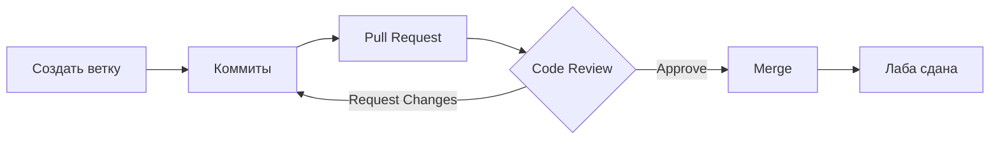

 # План курса: WPF + API (2 семестр)

## Концепция курса

### Философия: "Skeleton & Flesh First, Skin Later"

> Сначала Скелет и Мясо, Кожа потом.

Классический подход "сначала верстаем красиво, потом подключаем данные" — путь к переписыванию половины кода. Мы делаем наоборот: **Data Layer в самое начало**.

**Почему это работает:**

| Принцип | Описание |
|---------|----------|
| **Fail Fast** | Проблемы с сетью, JSON или async вылезут на 1-й лабе, а не перед зачётом |
| **Эстетика кода** | К моменту стилизации у студента уже сложная структура XAML — придётся думать об организации |
| **Мотивация** | Работать с реальными данными ("Мстители") интереснее, чем с "Item 1" |

---

## Роадмап лабораторных работ

| № | Название | Ключевые темы | Ветка Git |
|---|----------|---------------|-----------|
| 0 | Git Gud or Die Trying | Git, GitHub, .gitignore | — |
| 1 | Скелет и Нервы | Layout, HTTP GET, JSON | `feature/lab-1-skeleton` |
| 2 | Оживление Трупа | DataTemplate, Binding, Images | `feature/lab-2-binding` |
| 3 | Инженерный Отсек | UserControls, динамическая генерация UI | `feature/lab-3-controls` |
| 4 | Евроремонт | Styles, Resources, Themes | `feature/lab-4-styles` |
| 5 | Сделка с Дьяволом | POST-запросы, обработка ошибок, навигация | `feature/lab-5-booking` |

---

## Детальное описание лабораторных работ

### Лаба 0: "Git Gud or Die Trying"

**Тип:** Вводная, обязательная  
**Блокирует:** Лабу 1

!!! warning "Без этой лабы доступ к остальным закрыт"
    Нет в удалённом репо — нет лабы. Это спасает от "флешку дома забыл".

#### Легенда
Ты — новый стажёр. Тебе выдали пустой репозиторий. Задача — не засрать его мусором в первый же день.

#### Задачи

1. Создать аккаунт на GitHub (у кого нет)
2. Создать приватный репозиторий `CinemaKiosk_Фамилия`
3. Добавить `.gitignore` для Visual Studio
4. Первый коммит:
    - Создать Solution в VS
    - Добавить `README.md` (ФИО, Группа)
    - Push в `main`
5. Пригласить преподавателя в Collaborators

#### Критерии сдачи

- Преподаватель получил инвайт
- Репозиторий чистый (нет `/bin`, `/obj`, `.vs`)

!!! danger "Автоматическая пересдача"
    Папки `/bin`, `/obj` или `.vs` в репозитории = пересдача. Пусть гуглят "Visual Studio gitignore".

---

### Лаба 1: "Скелет и Нервы"

**Темы:** Layout + Basic HTTP

#### Цель
Базовый каркас приложения с первым GET-запросом к реальному API.

#### Задачи

1. Сверстать окно: слева — список (строки), справа — пустота
2. Написать метод `LoadMovies()`
3. Выполнить запрос `GET /api/movies`
4. Десериализовать JSON в `List<MovieDto>`
5. Вывести в `ListBox` через `.ToString()` (названия фильмов)

#### Ожидаемый результат
На экране появляются *реальные* данные. Выглядят убого, но это "Мстители", а не "Item 1".

#### Критерии сдачи

- Приложение запускается
- Данные загружаются с API
- Список отображает названия фильмов

---

### Лаба 2: "Оживление Трупа"

**Темы:** Data Binding & Templates

#### Цель
Превратить убогие строки в красивые карточки с реальными данными.

#### Задачи

1. Взять список из Лабы 1
2. Создать `DataTemplate` для карточки фильма
3. Загрузить картинки по URL из JSON
4. Реализовать связь: клик по списку → детали справа (`Binding SelectedItem`)

!!! note "Асинхронная загрузка изображений"
    Это отдельный мини-ад. Пусть страдают сразу — потом скажут спасибо.

#### Критерии сдачи

- Карточки с изображениями отображаются корректно
- Выбор элемента обновляет детальную панель
- Нет хардкода данных

---

### Лаба 3: "Инженерный Отсек"

**Темы:** UserControls & Logic

#### Цель
Кастомные контролы + генерация карты зала из данных API.

#### Задачи

1. Запрос `GET /api/sessions/{id}/seats` — получить матрицу мест
2. На основе массива построить карту зала (кнопки/контролы)
3. Реализовать логику выбора мест (Toggle/Untoggle) на клиенте

#### Почему именно здесь
Самая жёсткая лаба по алгоритмам отрисовки. Реальные данные показывают реальную геометрию залов.

#### Критерии сдачи

- Карта зала генерируется динамически
- Места можно выбирать/отменять
- UserControl вынесен в отдельный файл

---

### Лаба 4: "Евроремонт"

**Темы:** Styles, Resources & Themes

#### Цель
У студента уже есть работающее, но страшное приложение. Пора наводить красоту.

#### Задачи

1. Вынести стили в `App.xaml`
2. Оформить кнопки (скругления, тени)
3. Создать `ResourceDictionary`
4. Реализовать тёмную тему

#### Профит
Рефакторить *работающий* код приятнее. Одна строчка в `ResourceDictionary` меняет вид всего приложения.

#### Критерии сдачи

- Стили вынесены в ресурсы (не inline)
- Есть переключение светлая/тёмная тема
- Визуально приложение выглядит как продукт, а не прототип

---

### Лаба 5: "Сделка с Дьяволом"

**Темы:** POST Requests & Final Logic

#### Цель
Завершение полного цикла: бронирование билетов.

#### Задачи

1. Реализовать кнопку "Купить"
2. Отправить `POST /api/booking`
3. Обработать ответы сервера:

| Код | Значение | Действие |
|-----|----------|----------|
| 200 OK | Успех | Показать билет (QR) |
| 409 Conflict | Место занято | Сообщение "Место уже занято кем-то другим" |
| 400 Bad Request | Ошибка запроса | Сообщение об ошибке |

4. Финализировать навигацию между экранами

#### Критерии сдачи

- Бронирование работает
- Ошибки обрабатываются корректно (без крашей)
- Полный user flow от выбора фильма до билета

---

## Git-воркфлоу

### Главное правило

!!! danger "No Direct Push to Main"
    Это правило действует весь семестр. Нарушение = снижение оценки.

### Механика сдачи лабораторных работ



#### Пошагово

1. **Ветка:** Перед началом лабы создать ветку от `main`
    - Название: `feature/lab-N-описание`
2. **Коммиты:** Осмысленные сообщения
    - :white_check_mark: `Added Movie model and basic fetch logic`
    - :x: `upd`, `fix`, `asdasd`
3. **Pull Request:** Когда готово — создать PR на GitHub, НЕ мерджить самому
4. **Code Review:** Преподаватель оставляет комментарии к коду
5. **Фикс:** Исправления пушатся в ту же ветку
6. **Merge:** После Approve студент мерджит ветку

---

## Система оценивания (Геймификация)

### Ранги

| Ранг | Критерии |
|------|----------|
| **SILVER** | Код в репо. Коммиты типа "Lab 1 done". Возможно, мусор в репо (прощаем один раз) |
| **GOLD** | Идеальный `.gitignore`. Правильные названия веток. Читаемая история: `UI: Created main layout` |
| **PLATINUM** | Conventional Commits (`feat:`, `fix:`, `style:`). Красивый `README.md` со скриншотами и чеклистом |

### Примеры коммитов по Conventional Commits

```
feat: add movie list component
fix: crash on network timeout
style: reformat XAML indentation
refactor: extract HTTP client to service
```

---

## Wildcard-события

### "Time Travel" — Урок ответственности

**Когда:** Середина семестра (примерно Лаба 3)

**Легенда:** "Так, вы все накосячили в архитектуре на второй лабе. Откатываемся."

#### Задача для студентов

1. Найти коммит окончания Лабы 2
2. Создать ветку `fix/architecture-refactor` от этого коммита
3. Исправить архитектурный косяк
4. Смерджить обратно в `main`, разрешив конфликты с кодом Лабы 3

#### Эффект
Те, кто пройдёт через Merge Conflict в учебной среде, перестанут бояться его на работе. Это прививка от страха.

---

## Риски и рекомендации

### Что дать студентам заранее

!!! warning "Критически важно"
    Без DTO-классов студенты начнут парсить JSON через регулярки или `dynamic`. Это будет кровавая баня.

**Варианты:**

1. **Простой путь:** Выдать файл `Models.cs` с готовыми классами `Movie`, `Session`, `Seat`
2. **Продвинутый путь:** Дать Swagger и научить генерировать клиенты (может быть too much для 1 курса)

### Преимущества такого подхода

- Видишь **мыслительный процесс** студента по истории коммитов
- Легко отличить самостоятельную работу (коммиты равномерно 2 недели) от копипасты (один коммит "Add all files" в 4 утра)
- Можно менять данные на сервере и наблюдать реакцию (добавить фильм "Лаба не сдана, отчислен")

